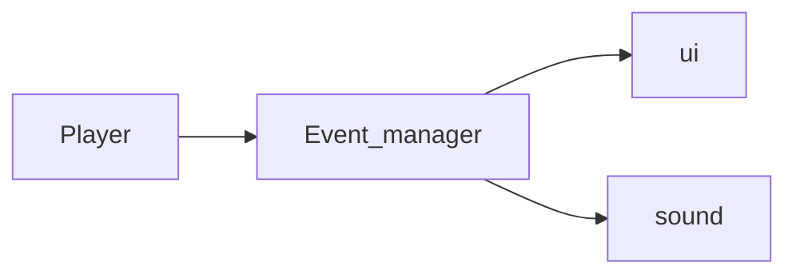

# Pipeline

## Architecture

### Event Caller

Game Constant, like player speed should use ScriptableObject

### Game Architecture links

[How to architect code as your project scales | Avoiding technical debt | Unity](https://unity.com/how-to/how-architect-code-your-project-scales)

[[C#] Delegates and Events (E01: delegates) - YouTube](https://www.youtube.com/watch?v=G5R4C8BLEOc)

[[C#] Delegates and Events (E02: events) - YouTube](https://www.youtube.com/watch?v=TdiN18PR4zk)[[C#] Delegates and Events (E02: events) - YouTube](https://www.youtube.com/watch?v=TdiN18PR4zk)
